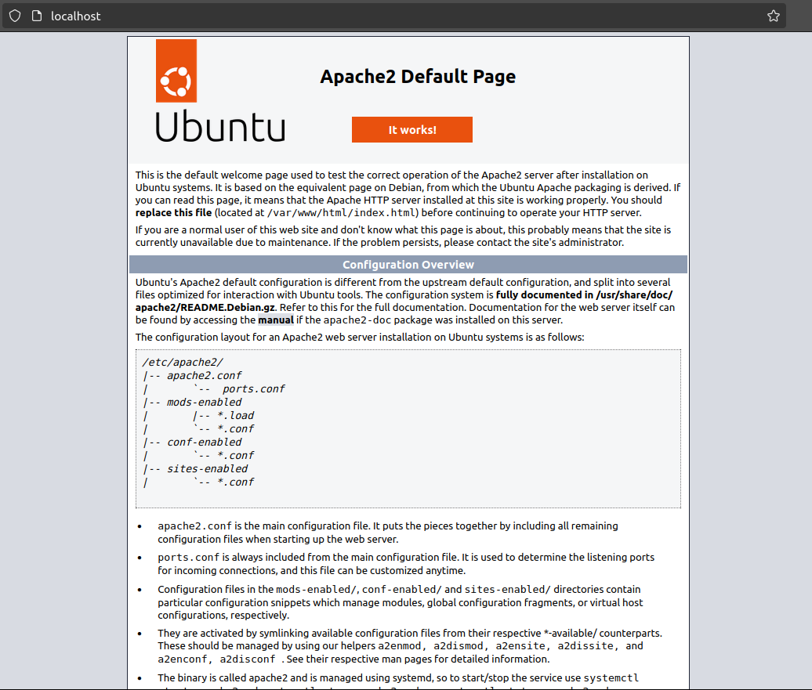
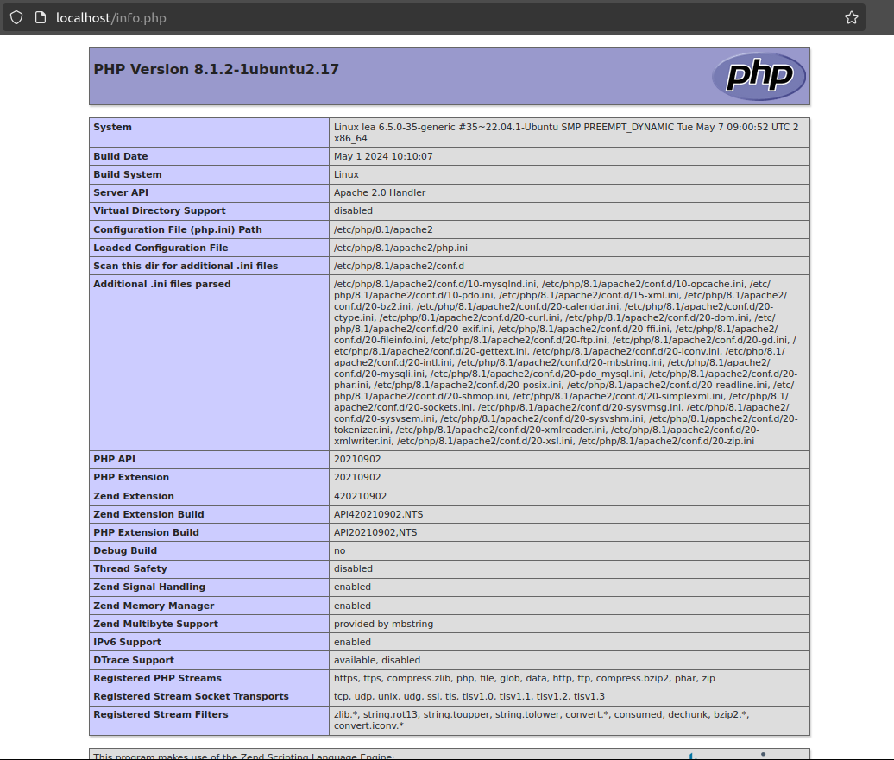

# Module 1 : Introduction à PHP
PHP, qui signifie "Hypertext Preprocessor", est un langage de script open source côté serveur largement utilisé pour le développement web. Initialement créé en 1994 par Rasmus Lerdorf, PHP a depuis évolué pour devenir l'un des langages de programmation les plus populaires pour créer des sites web dynamiques et des applications web.


### Historique et évolution de PHP
- 1994 : Création initiale
    - Rasmus Lerdorf a développé les premières versions de PHP pour gérer son site web personnel. À l'origine, PHP signifiait "Personal Home Page".
- 1995 : PHP/FI (Form Interpreter)
    - Lerdorf a publié le code source de PHP/FI pour que les développeurs puissent l'utiliser et le modifier.
- 1997 : PHP 3.0
    - Andi Gutmans et Zeev Suraski ont réécrit le noyau de PHP, conduisant à la version PHP 3. Cette version a introduit une syntaxe plus cohérente et des fonctionnalités améliorées.
- 2000 : PHP 4.0
    - Introduction du moteur Zend, développé par Gutmans et Suraski, qui a considérablement amélioré les performances.
- 2004 : PHP 5.0
    - Introduction de la Programmation Orientée Objet (POO) et amélioration des capacités de manipulation XML.
- 2015 : PHP 7.0
    - Augmentation significative des performances et ajout de nouvelles fonctionnalités comme les types scalaires et le moteur Zend Engine 3.0.
- 2020 : PHP 8.0
    - Introduction de JIT (Just-In-Time compilation) pour de meilleures performances et de nombreuses nouvelles fonctionnalités et améliorations syntaxiques.

### Utilisation et applications de PHP
PHP est utilisé principalement pour le développement web côté serveur, ce qui signifie qu'il s'exécute sur le serveur pour générer des pages web dynamiques avant de les envoyer au navigateur de l'utilisateur. Voici quelques-unes des principales applications et utilisations de PHP :

- Sites web dynamiques :
    - PHP est utilisé pour créer des pages web interactives et dynamiques. Par exemple, des sites comme ***Facebook*** et ***WordPress*** sont construits en utilisant PHP.

- Gestion de bases de données :
    - PHP s'intègre facilement avec plusieurs systèmes de gestion de bases de données comme MySQL, PostgreSQL, et SQLite, ce qui permet de créer des applications web basées sur des bases de données.

- Formulaires web :
    - PHP est couramment utilisé pour collecter des données via des formulaires HTML, traiter les informations et interagir avec des bases de données ou envoyer des emails.

- Applications web :
    - PHP est utilisé pour développer des applications web complètes, y compris des systèmes de gestion de contenu (CMS), des plateformes de commerce électronique, et des forums.

- Scripts côté serveur :
    - PHP peut automatiser des tâches côté serveur, telles que la génération de rapports, le traitement de fichiers, et l'interaction avec des APIs externes.

### Caractéristiques clés de PHP
- Simplicité et Facilité d'apprentissage :
    - PHP a une syntaxe claire et facile à apprendre, ce qui en fait un choix idéal pour les débutants.

- Flexibilité et Portabilité :
    - PHP fonctionne sur diverses plateformes (Windows, Linux, macOS) et peut être intégré avec de nombreux serveurs web comme Apache et Nginx.

- Communauté et Support :
    - PHP bénéficie d'une large communauté de développeurs, ce qui signifie qu'il y a une abondance de ressources, de documentation et de bibliothèques disponibles.

- Performance :
    - Les versions récentes de PHP offrent des performances élevées grâce à des améliorations constantes et à des fonctionnalités comme la compilation JIT.

PHP est un langage puissant et polyvalent qui joue un rôle crucial dans le développement web moderne. Sa simplicité, combinée à sa capacité à gérer des tâches complexes, en fait un outil indispensable pour les développeurs web. En apprenant PHP, vous vous dotez des compétences nécessaires pour créer des sites web dynamiques et interactifs, et vous ouvrez la porte à de nombreuses opportunités professionnelles dans le domaine du développement web.

# Installation et Configuration
Pour commencer à développer en PHP, vous devez installer un environnement de développement local qui comprend PHP, un serveur web (comme Apache ou Nginx), et une base de données (comme MySQL). Voici les étapes pour installer et configurer PHP sur votre machine :

1) **Choisir un Environnement de Développement**
- XAMPP : Disponible pour Windows, macOS, et Linux.
- WAMP : Spécifique à Windows.
- MAMP : Spécifique à macOS (mais une version Windows est également disponible).
- LAMP : Un ensemble d'outils pour Linux (Linux, Apache, MySQL/MariaDB, PHP).

**Installation de XAMPP (Windows, macOS, Linux)**
XAMPP est un choix populaire car il est compatible avec Windows, macOS et Linux.


1) Téléchargement de XAMPP :
    - Allez sur le site officiel de XAMPP : [Apache Friends](https://www.apachefriends.org/).
    - Téléchargez la version de XAMPP appropriée pour votre système d'exploitation.

2) Installation de XAMPP :
    - Exécutez le fichier d'installation téléchargé.
    - Suivez les instructions de l'installateur. Lors de la sélection des composants, assurez-vous que "Apache", "MySQL", et "PHP" sont sélectionnés.
    - Terminez l'installation.

3) Lancement de XAMPP :
    - Ouvrez le panneau de contrôle XAMPP.
    - Démarrez les modules "Apache" et "MySQL".

**Vérification de l'installation :**
1) Test du Serveur Web :
    - Ouvrez votre navigateur web et tapez http://localhost/.
    - Vous devriez voir la page d'accueil de XAMPP.
    
2) Test de PHP :
    - Dans le répertoire htdocs de XAMPP (généralement C:\xampp\htdocs), créez un fichier nommé info.php.
    - Ajoutez le code suivant dans ce fichier :
    ```php
    <?php
    phpinfo();
    ?>
    ```
    - Ouvrez votre navigateur web et tapez http://localhost/info.php.
    - Vous devriez voir une page avec les informations de configuration de PHP.
    

**Installation de WAMP (Windows)**


1) Téléchargement de WAMP :
    - Allez sur le site officiel de WAMP : [WampServer.](http://www.wampserver.com/)
    - Téléchargez la version de WAMP appropriée pour votre système (32 bits ou 64 bits).

2) Installation de WAMP :
    - Exécutez le fichier d'installation téléchargé.
    - Suivez les instructions de l'installateur.
    - Terminez l'installation.

3) Lancement de WAMP :
    - Ouvrez WampServer depuis le menu Démarrer.
    - Assurez-vous que l'icône WAMP dans la barre des tâches devient verte, ce qui signifie que les services sont en cours d'exécution.

**Vérification de l'installation :**
1) Test du Serveur Web :
    - Ouvrez votre navigateur web et tapez http://localhost/.
    - Vous devriez voir la page d'accueil de WAMP.

2) Test de PHP :

    - Dans le répertoire www de WAMP (généralement C:\wamp\www), créez un fichier nommé info.php.
    - Ajoutez le code suivant dans ce fichier :
    ```php
    <?php
    phpinfo();
    ?>
    ```
    - Ouvrez votre navigateur web et tapez http://localhost/info.php.
    - Vous devriez voir une page avec les informations de configuration de PHP.

**Installation de MAMP (macOS, Widows)**


1) Téléchargement de MAMP :
    - Allez sur le site officiel de MAMP : [MAMP & MAMP PRO](https://www.mamp.info/en/mamp-pro/mac/).
    - Téléchargez la version de MAMP appropriée pour macOS.

2) Installation de MAMP :
    - Exécutez le fichier d'installation téléchargé.
    - Suivez les instructions de l'installateur.
    - Terminez l'installation.

3) Lancement de MAMP :
    - Ouvrez MAMP depuis le dossier Applications.
    - Démarrez les serveurs Apache et MySQL.

**Vérification de l'installation :**
1) Test du Serveur Web :
    - Ouvrez votre navigateur web et tapez http://localhost:8888/.
    - Vous devriez voir la page d'accueil de MAMP.

2) Test de PHP :
    - Dans le répertoire htdocs de MAMP (généralement /Applications/MAMP/htdocs), créez un fichier nommé info.php.
    - Ajoutez le code suivant dans ce fichier :
    ```php
    <?php
    phpinfo();
    ?>
    ```
    - Ouvrez votre navigateur web et tapez http://localhost:8888/info.php.
    - Vous devriez voir une page avec les informations de configuration de PHP.

Vous avez maintenant installé et configuré un environnement de développement PHP sur votre machine. Vous êtes prêt à commencer à écrire et à exécuter des scripts PHP. Dans le prochain module, nous allons explorer la syntaxe de base de PHP et créer nos premiers scripts PHP.